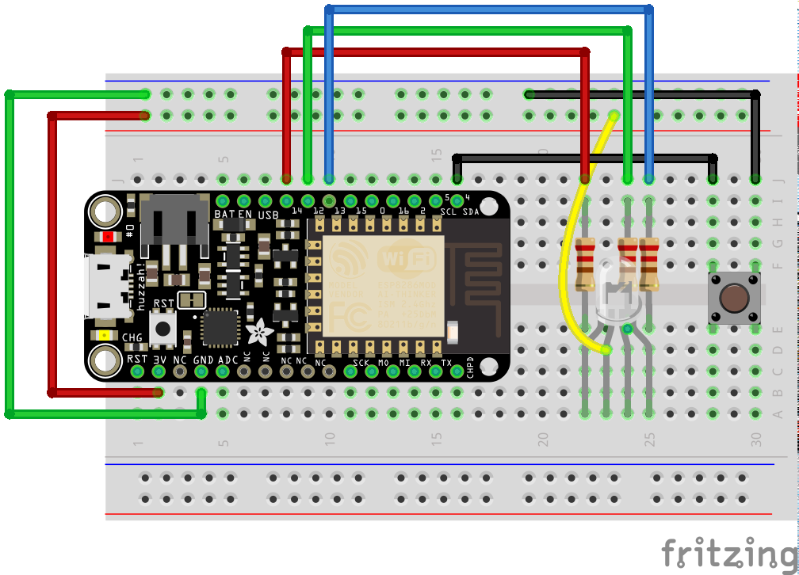

# color-torch
7-color LED controlled by AWS IoT

## Components

### IoT Thing

The IoT Thing is the physical hardware that uses a particular board, a RGB LED, and a button. It reads the state from AWS IoT and changes its local state to match, turning on/off the LED and setting a specific color. It also reports the current state back up to AWS IoT.

The software is written in mJS and runs using Mongoose-OS. The following boards/architectures have been tested:

* [esp8266](device/esp8266/)
  * Adafruit Feather Huzzah

### Browser Client

The Browser Client is a static website that connects to AWS IoT to get the reported state and to set a desired state. The buttons allow for on/off control as well as changing the color via the _desired_ state of the thing shadow.

### Alexa Skill

The Alexa skill allows voice commands to turn on/off the led and/or change the color.